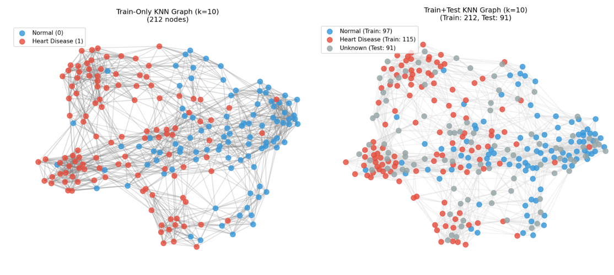
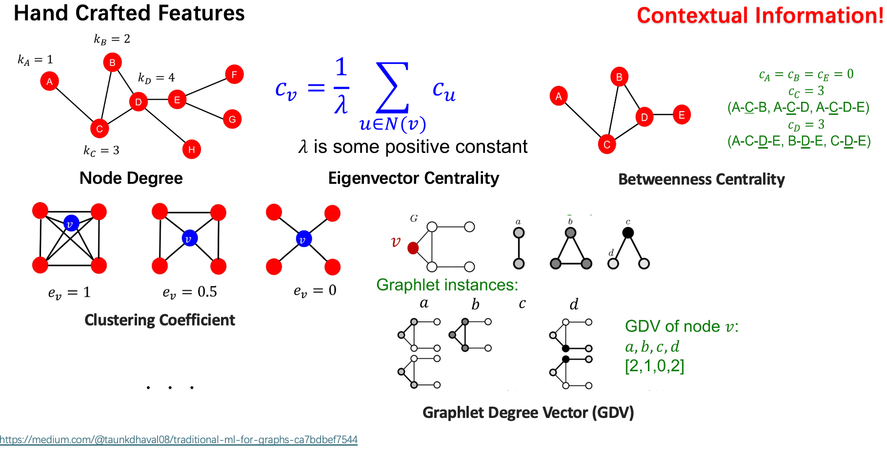
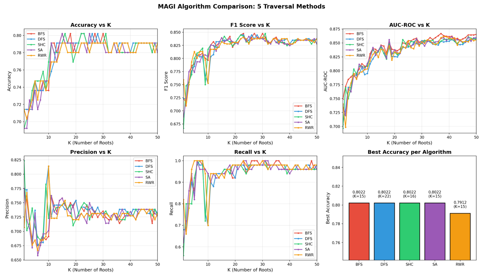
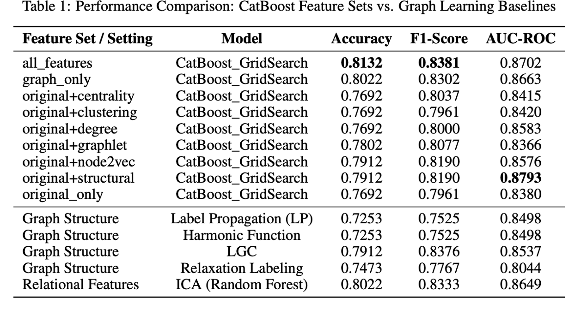

# Graph Learning — *A Table Is Worth a Graph*
**Another solution for traditional tabular data machine learning tasks**

This project proposes a **graph-based learning framework for tabular data**, where relational
structures are explicitly constructed from feature similarity and leveraged to improve
classification performance. Instead of treating samples as independent instances, we model them
as nodes in a graph and perform learning through **graph construction, graph feature learning,
and graph-based inference**.

---

## 1. Methodology Overview

<p align="center">
  
</p>

Our methodology consists of three main components:

1. **Graph Construction** from tabular data  
2. **Graph Feature Learning** to enrich node representations  
3. **Graph-based Inference Algorithms** for prediction  

---

## 2. Graph Learning

### 2.1 Graph Construction

To model relational dependencies among samples, we transform tabular data into a **K-Nearest Neighbor (KNN) graph** based on feature similarity.

- Each sample is represented as a **node**
- Edges are constructed according to **cosine similarity** in the standardized feature space
- For each node, connections are established with its top-*k* most similar neighbors
- The adjacency matrix is symmetrized to form an **undirected weighted graph**

Two graph settings are supported:

- **Inductive (Train-only) Graph**  
  Constructed using training samples only, suitable for supervised graph learning.

- **Transductive (Train–Test) Graph**  
  Built from both training and test samples, where test nodes remain unlabeled during training,
  enabling structure-aware inference without label leakage.


This graph representation serves as the foundation for all subsequent graph learning modules.

---

### 2.2 Graph Feature Learning

<p align="center">
  
</p>

To encode structural and relational information beyond raw attributes, we extract **node-level graph features** using two complementary approaches:

#### Handcrafted Structural Features
Traditional graph statistics are computed directly from topology, including:
- Node degree and average neighbor similarity  
- Clustering coefficient and local density  
- Connected component and global structural indicators  

These features are **interpretable** and describe the structural role of each node in the graph.

#### Node2Vec Embeddings
To capture higher-order dependencies, we adopt **Node2Vec**, a random-walk-based embedding method.
By balancing local and global exploration, Node2Vec learns dense vector representations that encode:
- Structural equivalence
- Neighborhood proximity
- Long-range graph dependencies

The final node representation is formed by concatenating:
> **Original features + handcrafted graph features + Node2Vec embeddings**

---

## 3. Algorithm: Multi-source Aggregated Golden Inference (MAGI)

<p align="center">
  
</p>

Inspired by Label Propagation, we propose **Multi-source Aggregated Golden Inference (MAGI)**, an inductive node classification algorithm defined over a fixed training graph. 

Let $G = (V, E)$ denote a labeled training graph with adjacency matrix $\mathbf{A} \in \mathbb{R}^{|V|\times|V|}$, node feature matrix $\mathbf{X} \in \mathbb{R}^{|V|\times d}$, and node labels $\mathbf{y} \in \{0,1\}^{|V|}$. Given a previously unseen test node $v^\ast$ with feature vector $\mathbf{x}^\ast \in \mathbb{R}^d$, MAGI aims to infer a continuous prediction score $s^\ast$ without modifying the graph structure.

### 3.1 Core Mechanisms

#### Root Node Selection
MAGI first defines a similarity function $\sigma : \mathbb{R}^d \times \mathbb{R}^d \rightarrow \mathbb{R}$ using cosine similarity. For the test node $v^\ast$, similarity scores $\{\sigma(\mathbf{x}^\ast, \mathbf{x}_v)\}_{v \in V}$ are computed against all training nodes. The top-$K$ nodes with highest similarity scores are selected to form the root set $\mathcal{R} \subset V$:

$$
\mathcal{R} = \arg\max_{|\mathcal{S}| = K} \sum_{v \in \mathcal{S}} \sigma(\mathbf{x}^\ast, \mathbf{x}_v)
$$

#### Golden Memory Propagation
For each root node $r \in \mathcal{R}$, MAGI performs a graph traversal process that induces a sequence of node layers $\{\mathcal{L}_k^{(r)}\}_{k=0}^{\infty}$, where $\mathcal{L}_0^{(r)} = \{r\}$ and $\mathcal{L}_k^{(r)}$ contains all newly discovered nodes at depth $k$. Let $w_{uv} = A_{uv}$ denote the edge weight between nodes $u$ and $v$.

At each layer $k \geq 1$, a similarity-aware aggregation of labels is computed as:

$$
E_k^{(r)} = \sum_{v \in \mathcal{L}_k^{(r)}} \alpha_v^{(k)} \, y_v, \quad \text{where} \quad \alpha_v^{(k)} = \frac{\exp(w_{p(v)v})}{\sum_{u \in \mathcal{L}_k^{(r)}} \exp(w_{p(u)u})}
$$

Here, $p(v)$ denotes the parent node of $v$ in the traversal tree. For the root layer, the experience is defined as $E_0^{(r)} = y_r$.

The **golden memory** accumulated from root $r$ is then defined as a discounted sum over layers:

$$
M_r = \sum_{k=0}^{K_r} \phi^k \, E_k^{(r)}
$$

where $\phi \in (0,1)$ is the golden decay factor and $K_r$ denotes the traversal depth at convergence. The traversal is terminated when the incremental memory update satisfies $\left| M_r^{(k)} - M_r^{(k-1)} \right| < \epsilon$, ensuring numerical stability.

#### Multi-source Aggregation
Each root node $r \in \mathcal{R}$ produces an independent golden memory score $M_r$. To aggregate information from multiple structurally similar regions, MAGI assigns a normalized importance weight to each root based on feature similarity:

$$
\beta_r = \frac{\exp(\sigma(\mathbf{x}^\ast, \mathbf{x}_r))}{\sum_{u \in \mathcal{R}} \exp(\sigma(\mathbf{x}^\ast, \mathbf{x}_u))}
$$

The final prediction score for the test node is obtained as:

$$
s^\ast = \sum_{r \in \mathcal{R}} \beta_r \, M_r
$$

---

### 3.2 Traversal Strategy Generalization

In MAGI, golden memory propagation is driven by a graph traversal process. Generally, the traversal can be formalized as an operator $\mathcal{T}: (G,r) \longmapsto \mathbb{P}\bigl(\pi^{(r)} \mid G\bigr)$, which defines a sequence of nodes. The golden memory of root $r$ can be expressed as an expectation over traversal-induced paths:

$$
M_r = \mathbb{E}_{\pi^{(r)} \sim \mathcal{T}} \left[ \sum_{k=0}^{K_r} \phi^k \, y_{\pi_k} \, \omega(\pi_{0:k}) \right]
$$

MAGI unifies multiple traversal mechanisms under this framework:

#### 1. Breadth-First Search (BFS)
BFS defines a deterministic traversal where nodes are grouped by shortest-path distance from the root:
$$
\mathcal{L}_k^{(r)} = \{v \in V \mid \text{dist}(r,v)=k\}
$$
BFS yields low-variance, locality-preserving estimates and is effective on homophilic graphs.

#### 2. Depth-First Search (DFS)
DFS induces path-based traversals $\pi^{(r)} = (r, v_1, v_2, \dots)$. The golden memory accumulation reduces to a path-weighted sum emphasizing long-range dependencies:
$$
M_r = \sum_{k=0}^{K_r} \phi^k \, y_{\pi_k} \prod_{j=1}^{k} A_{\pi_{j-1}\pi_j}
$$

#### 3. Stochastic Hill Climbing (SHC)
SHC defines a stochastic traversal guided by edge weights. The transition probability is defined as:
$$
P_{\text{SHC}}(v \mid u) = \frac{\exp(A_{uv}/T)}{\sum_{z \in \mathcal{N}(u)} \exp(A_{uz}/T)}
$$
where $T>0$ is a temperature controlling the exploration–exploitation trade-off.

#### 4. Simulated Annealing (SA)
SA extends SHC by introducing a depth-dependent temperature schedule $T_k = T_0 \gamma^k$. A proposed transition $u \rightarrow v$ is accepted with probability:
$$
P_{\text{SA}}(u \rightarrow v) = \exp\!\left(\frac{A_{uv}-1}{T_k}\right)
$$
This allows early exploration of weak edges and increasingly selective traversal at deeper steps.

#### 5. Random Walk with Restart (RWR)
RWR defines a Markovian traversal with restart probability $\alpha \in (0,1)$. At each step:
$$
P(\pi_{k+1}=v \mid \pi_k=u) = \begin{cases} \alpha, & v = r, \\ (1-\alpha)\dfrac{A_{uv}}{\sum_{z} A_{uz}}, & v \in \mathcal{N}(u). \end{cases}
$$
The golden memory reduces to an empirical estimate of the expected label: $M_r \approx \mathbb{E}_{v \sim \pi_r^{(\alpha)}}[y_v]$.

---

## 4. Experimental Results and Analysis

### 4.1 MAGI Performance and Sensitivity Analysis

<p align="center">
  
</p>

We investigate the impact of the hyperparameter $K$ (the number of selected root nodes) on the model's predictive performance. The analysis reveals a distinct two-phase behavior:

1.  **Rapid Improvement Phase ($0 < K \le 10$):**
    When $K$ increases from a small value (e.g., single-source inference) to 10, all evaluation metrics (Accuracy, F1-Score) exhibit a significant and monotonic upward trend. This validates the core premise of MAGI: relying on a single root node is susceptible to noise. By increasing $K$, the algorithm aggregates "golden memories" from diverse regions, reducing variance.

2.  **Convergence and Stabilization Phase ($K \approx 25$):**
    As $K$ exceeds 10, the rate of performance gain diminishes, eventually plateauing around $K=25$. This suggests that the top-ranked nodes capture the most relevant structural contexts. The similarity-based weighting mechanism $\beta_r$ effectively handles lower-ranked nodes, preventing performance degradation from irrelevant sources.

**Conclusion:** MAGI benefits significantly from multi-source aggregation and exhibits stable behavior without requiring an excessively large number of reference nodes.

---

### 4.2 Graph Distilled Classifier (GDC)

<p align="center">
  
</p>

To further exploit graph structure, we propose the **Graph Distilled Classifier (GDC)**, which distills
complex graph information into a tabular feature space compatible with powerful supervised learners
such as **CatBoost** and **XGBoost**.

GDC integrates:
- Structural graph descriptors (centrality, clustering, Node2Vec)
- Multi-hop label propagation statistics
- Original node attributes

Experiments show that:
- Graph-distilled features significantly outperform original tabular features
- Structural information alone is highly discriminative
- GDC consistently surpasses classical graph-based baselines

---

## 5. Key Takeaways

- **Tabular data can benefit greatly from graph representations**
- Explicit modeling of relational structure improves robustness and accuracy
- Multi-source inference and graph feature distillation are effective alternatives to traditional GNNs
- Graph learning provides a principled bridge between tabular ML and relational reasoning

---

## Repository Structure

```text
GraphLearning/
├── Algorithms/
├── Datasets/
├── FeatureExtraction/
├── GraphConstruction/
├── Preprocessing/
├── Figs/
├── main.py
└── README.md
